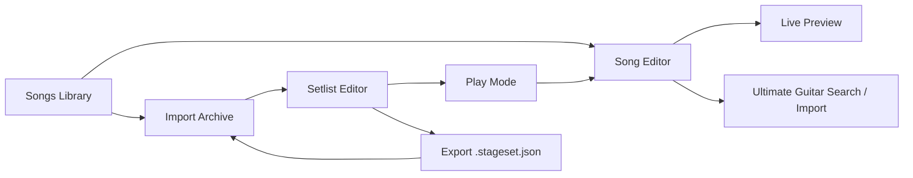

# StageSet

StageSet is a tablet-first Android app for musicians who need a clean song library, fast setlist building, and a live-friendly reading experience on stage.

The project is built with Kotlin, Jetpack Compose, Room, OkHttp, and Jsoup. It is designed around a simple idea: songs should be easy to collect and edit before rehearsal, then easy to read and step through during performance.

## Table of Contents

- [What StageSet Is](#what-stageset-is)
- [Feature Highlights](#feature-highlights)
- [How the App Works](#how-the-app-works)
- [Chart Format](#chart-format)
- [Ultimate Guitar Integration](#ultimate-guitar-integration)
- [Setlist Archive Format](#setlist-archive-format)
- [Architecture Overview](#architecture-overview)
- [Project Structure](#project-structure)
- [Build and Run](#build-and-run)
- [Testing](#testing)
- [Limitations and Tradeoffs](#limitations-and-tradeoffs)
- [License](#license)

## What StageSet Is

StageSet is an offline-first live performance companion for Android. It stores songs locally, lets you organize them into reusable setlists, and renders charts in a way that is readable from a music stand, tablet mount, or rehearsal screen.

The app is optimized for larger screens, but it still adapts to smaller devices:

- On compact screens it uses a bottom navigation bar.
- On wider screens it switches to a navigation rail and split-pane layouts.
- During performance views it keeps the screen awake so the display does not sleep mid-song.

The core app works without a network once songs are saved. Internet is only needed for remote import and search features.



## Feature Highlights

### 1. Song library built for performance

Each song is stored with:

- title
- artist
- preset
- key signature
- chart text
- last-modified timestamp

The Songs screen keeps the library alphabetized by title and supports quick filtering across title, artist, preset, and key. That makes it practical to search by tune name, performer, patch name, or harmonic key when you are preparing for a set.

### 2. Song editor with live chart preview

The song editor is more than a form. It gives you a side-by-side editing workflow on larger screens:

- metadata fields for title, artist, preset, and key
- a monospace chart editor for lyrics and chords
- a live-rendered preview panel
- transpose up/down actions that update both the key signature and detected chord lines

On smaller devices the same pieces stack vertically, so the editor still works well without losing the preview.

### 3. Preview controls designed for stage readability

StageSet has a dedicated preview settings model shared by both single-song preview and setlist play mode. These settings are stored locally on the device and can be changed at runtime:

- show or hide lyrics
- show a short lyric cue line instead of full lyrics
- show or hide chord lines
- show or hide melody notation blocks
- hide repeated chord lines in later matching sections
- compress chord-only views into more compact symbolic lines
- split charts into two columns on larger screens
- color matching section families such as Verse, Chorus, and Bridge
- increase or decrease chart text size on the fly

This makes the same source chart usable for different situations: rehearsal, rehearsal with cues only, chord-only playing, or dense setlist playback on a tablet.

### 4. Built-in melody notation blocks

Songs can contain melody notation blocks using a lightweight Music Macro Language style syntax. These notation blocks are rendered into actual staff notation in the preview, instead of remaining plain text.

Supported concepts include:

- note letters `A-G`
- sharps, flats, and naturals
- rests
- note lengths such as whole, half, quarter, eighth, and shorter values
- dotted values
- octave changes
- ties
- key signature
- meter
- clef
- optional tempo marking

This is useful for intros, horn lines, riffs, pickups, or vocal reminders that are easier to think about as notation than as prose.

### 5. Ultimate Guitar search and import flow

Inside the song editor, StageSet can search Ultimate Guitar for chord results and import a selected tab directly into the current song draft.

The flow includes:

- a one-time disclaimer acceptance stored in local preferences
- search driven from the editor using the current song name and artist as the default query when available
- filtering to chord-style results only
- import from a selected result into the editable song draft
- conversion of Ultimate Guitar markup into StageSet's preview-friendly chart format

Under the hood the importer is defensive: it tries an API-backed search path first and can fall back to parsing search pages when needed.

### 6. Setlist builder with reusable song pool

Setlists are created from the saved song library. The setlist editor has two main panes on larger screens:

- a searchable song pool
- a queued running order

You can:

- give the setlist a name
- add show notes
- add songs from the library
- add the same song more than once if your performance needs it
- move songs up and down
- remove songs from the running order

This makes StageSet flexible for medleys, reprises, or multiple arrangements of the same material.

### 7. Setlist play mode for live performance

Setlist preview is effectively a performance mode. It shows one song at a time and adds transport controls around the chart:

- previous/next song buttons with titles
- current song index indicator
- adjustable text size
- preview settings access
- a drawer-based song picker with search
- edit-in-context support that returns you to the same song position afterward

This is one of the strongest parts of the app's flow: you can stay inside the setlist, jump directly to a specific tune, quickly edit it, and then return to the same place in the running order.

### 8. Import and export of setlist archives

StageSet supports saving a complete setlist as a JSON archive and loading it later through Android's document picker.

An exported archive contains:

- setlist metadata
- the songs referenced by that setlist
- the running order entries

When importing an archive, StageSet reuses existing songs if an exact match is already present in the local library. That prevents duplicates when the same chart already exists on the device.

### 9. Offline-first storage

The app uses a local Room database for songs and setlists, and SharedPreferences for lightweight UI preferences such as preview toggles and import disclaimer acceptance.

That means:

- your main library and setlists are local-first
- the app stays useful without a connection
- the remote search/import features remain optional extras instead of core dependencies

## How the App Works

This section describes the main user journey and how the screens connect.

### Songs flow

1. Open the app on the `Songs` tab.
2. Search the library if needed.
3. Create a new song or open an existing one.
4. Edit song metadata and chart content.
5. Optionally search Ultimate Guitar and import a tab into the current draft.
6. Save the song back to the local database.
7. Open the song preview to read it in performance mode.

### Song preview flow

When a song is opened in preview mode, StageSet:

- loads the saved song from Room
- formats the chart into preview lines
- classifies lines as section headers, chord lines, lyric lines, lyric cues, melody notation, or empty spacing
- applies local preview settings
- renders the result with scalable typography and optional two-column layout

The preview screen is not a separate copy of the song. It is a rendered view of the same saved chart data.

### Setlist flow

1. Open the `Setlists` tab.
2. Create a new setlist or edit an existing one.
3. Search the song pool.
4. Add songs to the queue in performance order.
5. Save the setlist.
6. Open the setlist in play mode.
7. Step through songs with previous/next controls or jump using the side drawer.

### Edit-in-context from setlist play mode

One subtle but important workflow detail is that the setlist player remembers which song you were on when you jump into the editor. After editing and returning, the app restores that song position instead of sending you back to the first item in the setlist.

### Settings persistence

Two kinds of lightweight state are stored outside the database:

- preview settings, so the device remembers your reading preferences
- Ultimate Guitar disclaimer acceptance, so the search disclaimer is only shown until the user accepts it

## Chart Format

StageSet stores charts as plain text, but the preview engine interprets that text with a few structure-aware rules.

### Section headings

Section headings are written in square brackets:

```text
[Verse]
[Verse 2]
[Pre-Chorus]
[Bridge]
```

The formatter normalizes common section labels and groups related sections so features like section coloring and repeated-chord suppression can work reliably.

### Chord lines

Chord lines are detected heuristically. If a line looks like a sequence of chord symbols, StageSet treats it as harmonic content instead of lyrics.

Examples:

```text
G      D/F#   Em
Bbmaj7   F/A   Gm7
N.C.
```

Chord lines are important because they drive:

- transposition
- chord-only preview
- repeated-chord hiding
- compact chord rendering

### Lyric lines

Anything that does not parse as a chord line remains lyric text. Lyrics are rendered in a monospace style so spacing still feels intentional and readable.

### Melody notation blocks

Notation can be written inline or as a block.

Inline form:

```text
@ key=G meter=4/4 clef=treble o4 l8 g a b d @
```

Block form:

```text
@
key=G meter=4/4 clef=treble
o4 l4 g a b d
@
```

### Example chart

```text
[Verse 1]
G         D/F#      Em
Amazing grace how sweet the sound
C         G         D
That saved a wretch like me

[Instrumental]
@
key=G meter=4/4 clef=treble
o4 l8 g a b d > g4
@
```

### Melody notation quick reference

| Token | Meaning |
| --- | --- |
| `t120` | tempo in BPM |
| `o4` | current octave |
| `l8` | default note length |
| `>` / `<` | octave up / down |
| `a` to `g` | note letters |
| `#`, `b`, `n` | sharp, flat, natural |
| `r` | rest |
| `&` | tie to the next note of the same pitch |
| `key=Ebm` | visible key signature |
| `meter=4/4` | visible time signature |
| `clef=treble` | visible clef |

## Ultimate Guitar Integration

StageSet includes a dedicated remote import stack for Ultimate Guitar content.

### What the user sees

From the song editor, the user can:

- enter a search query
- open a dedicated Ultimate Guitar search dialog
- browse chord results
- pick a result to import into the current song

### What happens internally

The importer currently has several layers:

1. Search requests go through `UltimateGuitarImporter`.
2. The importer tries an API-backed search first.
3. If that fails, it falls back to parsing the Ultimate Guitar search page HTML.
4. When a tab is imported, StageSet extracts metadata such as title, artist, and key when available.
5. Ultimate Guitar markup is normalized into plain chart text for StageSet's preview engine.

### Defensive behavior

The project assumes that third-party markup can change. The import code therefore includes:

- multiple JSON extraction strategies
- HTML fallback handling
- filtering to chord-oriented results
- best-effort metadata extraction

The codebase also contains a WebView browser-fallback dialog for blocked pages, even though the current main user flow centers on search-and-select import.

## Setlist Archive Format

StageSet archives are JSON documents with a predictable structure:

- top-level format marker
- schema version
- export timestamp
- setlist metadata
- song payloads
- entry order references

File names are generated automatically from the setlist name and use the `.stageset.json` suffix.

Import behavior is intentionally careful:

- archives without playable entries are rejected
- missing song references are rejected
- exact duplicate songs are reused instead of blindly duplicated
- imported setlists are created as new local setlists

This makes the archive system useful for backup, migration, or sharing stage-ready show plans across devices.

## Architecture Overview

### App shell

- `MainActivity` hosts the Compose app and keeps the display awake.
- `StageSetApplication` creates a single `AppContainer`.
- `AppContainer` wires together Room, repositories, and importer dependencies.

### Navigation

`StageSetApp` owns the top-level navigation graph:

- Songs
- Song Preview
- Song Editor
- Setlists
- Setlist Preview
- Setlist Editor

It also switches between bottom navigation and navigation rail layouts based on available width.

### Persistence

Room is used for the main domain data:

- `songs`
- `setlists`
- `setlist_songs`

The database version is currently `2`, including a migration that added the `preset` field to songs.

### Repositories

- `SongRepository` handles song reads, writes, deletes, and Ultimate Guitar integration.
- `SetlistRepository` handles setlist reads, writes, deletes, and archive import/export.
- `PreviewSettingsRepository` persists per-device preview settings in SharedPreferences.
- `UltimateGuitarConsentRepository` persists the one-time disclaimer acceptance in SharedPreferences.

### Preview engine

The preview pipeline is one of the most important technical pieces in the app:

1. Parse raw chart text into logical sections.
2. Detect chord lines versus lyric lines.
3. Detect melody notation blocks.
4. Build a normalized preview model.
5. Apply render options such as hiding lyrics, compacting chords, or splitting into columns.
6. Render through Compose using `ChartPreview` and `MelodyStaffPreview`.

This shared preview path keeps single-song preview and setlist play mode visually consistent.

### Remote integration

Ultimate Guitar integration relies on:

- `OkHttp` for requests
- `Jsoup` for HTML parsing
- `org.json` for structured payload extraction

The parser is intentionally resilient rather than tightly coupled to one exact page shape.

## Project Structure

```text
app/
  src/main/java/com/codex/stageset/
    chart/                  Chord parsing, transposition, section support, melody notation
    data/local/             Room entities, DAO interfaces, database
    data/remote/            Ultimate Guitar search and import logic
    data/repository/        App-facing repositories and archive codec
    ui/common/              Shared preview UI, dialogs, document helpers
    ui/songs/               Songs list, editor, preview, import dialogs
    ui/setlists/            Setlists list, editor, play mode
    ui/theme/               Compose theme
  src/test/                 Unit tests
gradle/
  libs.versions.toml        Central dependency and plugin versions
```

## Build and Run

### Requirements

- JDK 17
- Android SDK 35
- Android Studio or a working Android command-line toolchain
- An emulator or physical Android device

The app is configured with:

- `applicationId`: `com.codex.stageset`
- `minSdk`: `26`
- `targetSdk`: `35`
- `compileSdk`: `35`
- Kotlin JVM target: `17`

### Build commands

Windows:

```powershell
.\gradlew.bat assembleDebug
.\gradlew.bat testDebugUnitTest
```

macOS / Linux:

```bash
./gradlew assembleDebug
./gradlew testDebugUnitTest
```

### Installing from Android Studio

1. Open the project root in Android Studio.
2. Let Gradle sync.
3. Make sure the IDE is using JDK 17.
4. Select a device or emulator.
5. Run the `app` configuration.

### Troubleshooting

If Gradle fails with an error similar to `java.exe is not recognized`, the machine does not currently have a usable JDK on `PATH`. Installing or configuring JDK 17 resolves that.

## Testing

Unit tests live under `app/src/test` and currently cover several of the most important logic-heavy areas:

- chord transposition
- melody notation parsing
- melody staff layout behavior
- Ultimate Guitar parsing
- Ultimate Guitar search result parsing
- preview chart formatting
- setlist archive encoding and decoding

Run them with:

```powershell
.\gradlew.bat testDebugUnitTest
```

At the moment, the repo is strongest in unit-tested parser and formatter logic. There are no committed Android instrumentation tests in `app/src/androidTest` yet.

## Limitations and Tradeoffs

- There is no cloud sync, account system, or cross-device state replication yet.
- Ultimate Guitar import depends on third-party endpoints and markup that can change over time.
- Preview settings are device-level preferences, not per-song or per-setlist profiles.
- Search and import require network access, but the main library and setlist experience are local-first.
- The archive format is practical and readable JSON, not an encrypted package format.

These tradeoffs keep the app focused and lightweight, but they are worth knowing if you plan to extend it.

## License

This project is licensed under the Apache License 2.0. See [LICENSE](LICENSE).
